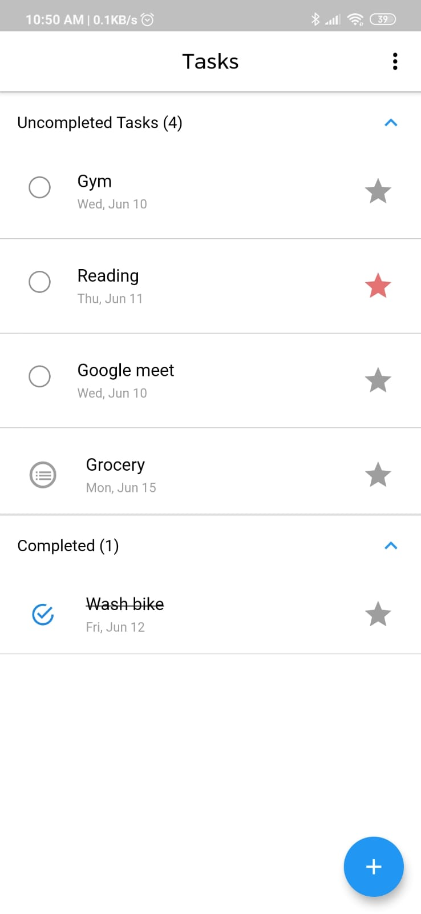
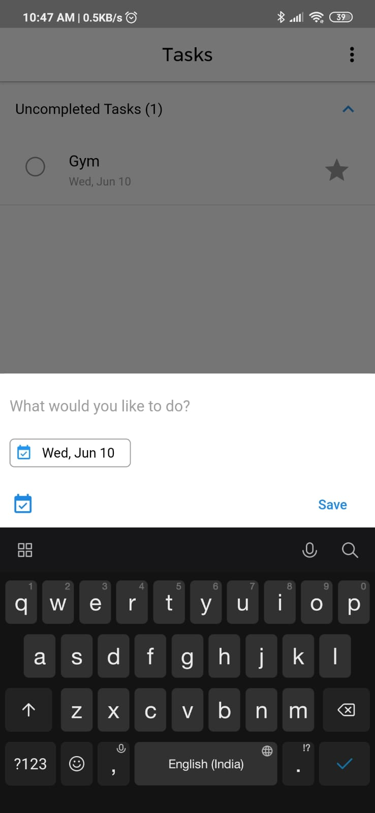
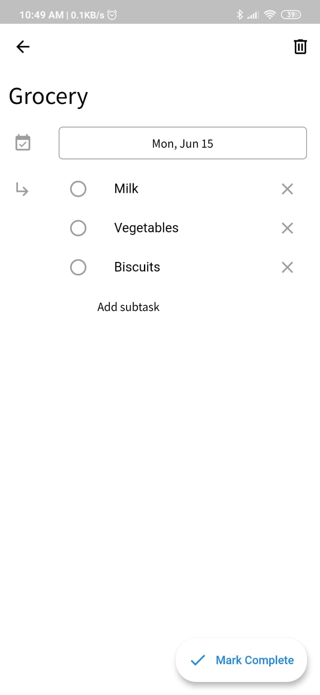
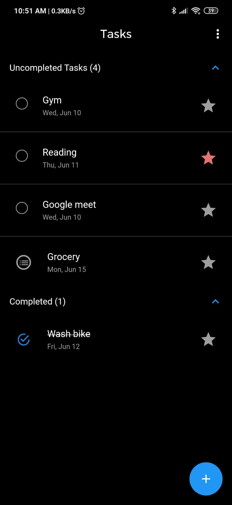
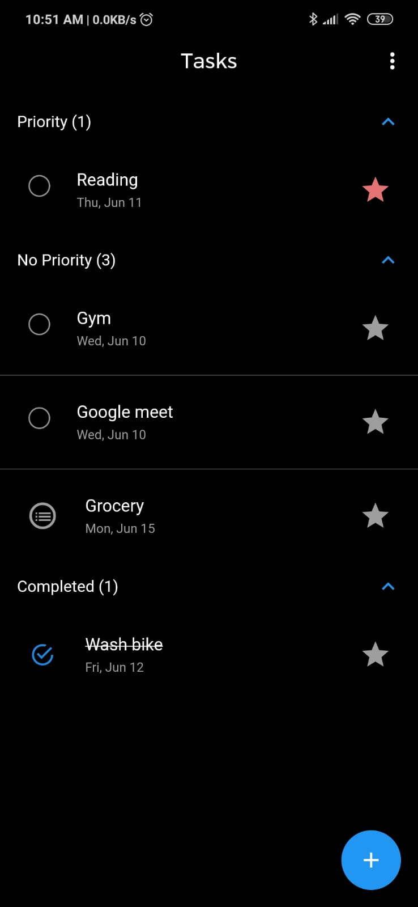
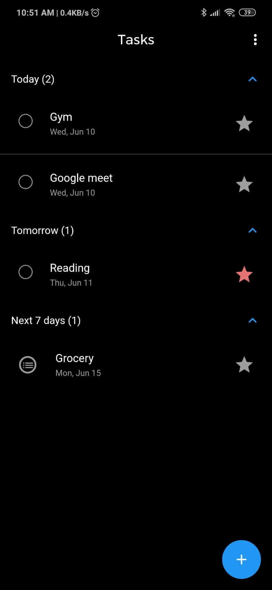

# Todo

Todo application made using Flutter and implements BLOC using flutter_bloc library.

## Features

- Add , Edit and Delete Task
- Add , Edit and Delete Subtasks
- Sort by Date , Priority
- Theme Support

## Screenshots

<div style="text-align: center">
  <table>
    <tr>
      <td style="text-align: center">
        
      </td>
      <td style="text-align: center">
        
      </td>
      <td style="text-align: center">
        
      </td>
    </tr>
    <tr>
      <td style="text-align: center">
        
      </td>
      <td style="text-align: center">
        
      </td>
      <td style="text-align: center">
        
      </td>
    </tr>
  </table>
</div>

## Getting Started

```
git clone https://github.com/nilay1221/Todo.git
cd todo
flutter packages get
flutter run
```
